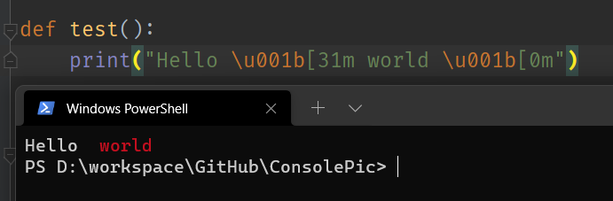

# 通过控制台输出各种颜色的字符——ANSIConsole

## ANSI（escape sequences）

先说说什么是ANSI escape sequences（ANSI转义序列），因为上述的都是以它为实现的。

ANSI转义序列是带随路信令控制视频文本终端上光标位置、颜色和其他选项的标准，这些序列代码是由ANSI编码字符构定义的，某些字节序列，大多数是从ESC和“O”开始的，嵌入到文本中，终端将查找并解释为命令，而不是字符代码。 如我们最常用到的就是\n \t等转义字符。
ANSI转义序列从上世纪80年代开始使用，要知道当时可没有什么windows界面，为了解决排版和一些光标问题，就使用了该转义序列，通过它不仅可以改变终端的输出，还可以绘制一些图案，非常实用。尽管现在文本终端越来越少见，但是在开发中还是常用的，如win32控制台，或者IDE的控制台。

## 示例

输出了红色的red字，\u001b是ESC的转义，31m代表红色, 使用[0m或者[39;49重置.

*字体颜色：30:黑 31:红 32:绿 33:黄 34:蓝色 35:紫色 36:深绿 37:白色 背景：40:黑 41:深红 42:绿 43:黄色 44:蓝色 45:紫色 46:深绿 47:白色。*

*例如：我们想让某个字符变为黄色，那么ESC [33m, 即\u001b[33m*

