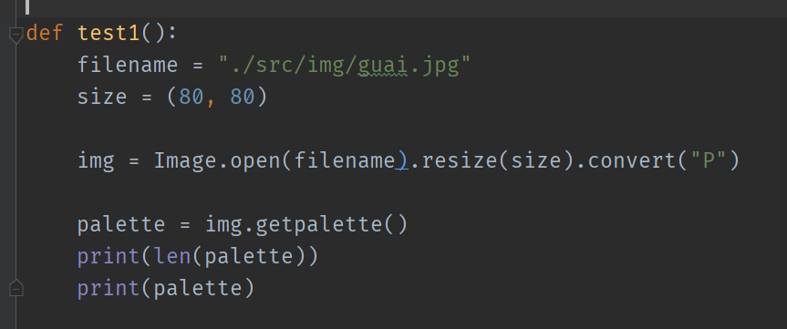
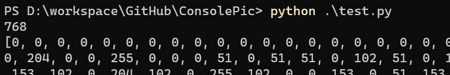

# 图像模式"P"

* P代表palette，调色板，也就是图片中会包含一个调色表的列表，每一个像素位置放的只是一个index，那么这个像素要展示的颜色就是调色板中第index位置展示的颜色.	
* 我用到的图片显示出的palette是768长度，也就是256 \* 3， 因为每个颜色需要RGB三个通道，所以768长度也就对应了256种颜色，这种图片最多能展示256中颜色，而传统的RGB最多可以展示256\*256\*256种颜色

# 示例代码

